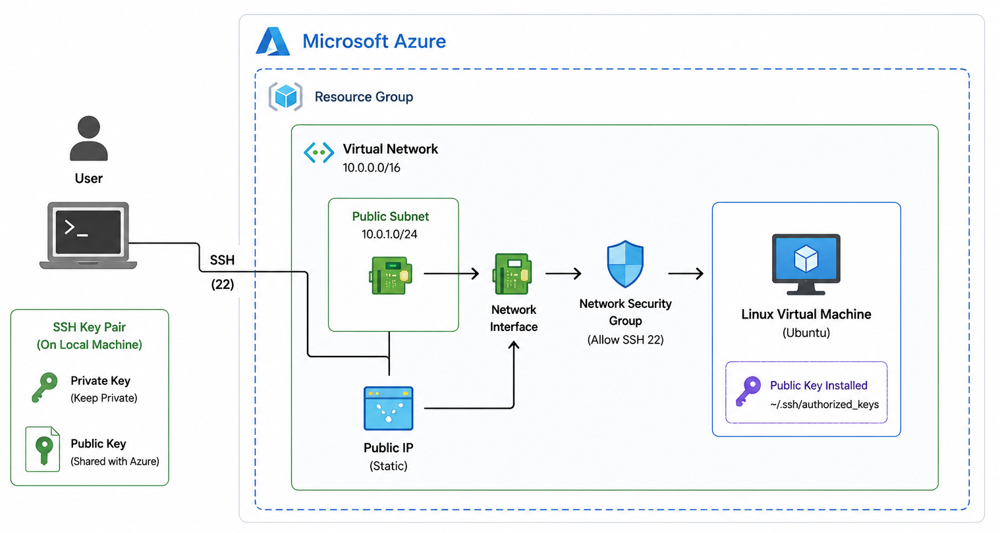

# Azure VM setup using Terraform

## Diagram

<p align="center">
  
</

---
## Prerequisites

**Install the following tools:**
- Terraform
- Azure CLI
- Git
- Visual Studio Code
- An active Azure subscription

**Verify Terraform:**
```bash
terraform --version
```
**Verify Azure CLI:**
```bash
az version
```
**Login to Azure:**
```bash
az login
```
**Verify the active Azure subscription:**
```bash
az account show
```

## Terraform Deployment

####  Clone the repo:
```bash
   git clone https://github.com/saifuddin-md/azure-vm-terraform.git
   cd azure-vm-terraform
 ```
#### 2. Copy and edit variables: (Update variable values as needed — VPC, CIDR, public key, region, etc.)
 ```bash
   cp terraform.tfvars.example terraform.tfvars
   ```

#### 3. Initialize Terraform:
   ```bash
   terraform init
   ```

#### 4. Format the Terraform files:
  ```bash
   terraform fmt -recursive
  ```

#### 5. Validate the configuration:
  ```bash
    terraform validate
  ```

#### 6. Plan and Apply:
   ```bash
   terraform plan
   terraform apply
   ```
---

